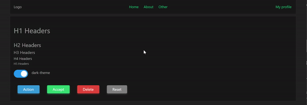

# Vue3 boilerplate

This repository contains a minimal boilerplate for starting a new Vue 3 project. It includes the essential tools and configurations to get you up and running quickly.



## Features

- **Vue 3**: The latest version of Vue.js for building modern web applications.
- **Vue Router**: Efficient routing management for your Vue application.
- **Sass**: A powerful CSS extension language that allows you to use variables, nested rules, and more.
- **Normalize.css**: Ensures consistent styling across different browsers by providing better cross-browser defaults.
- **Organized Folder Structure**: A clean and intuitive folder structure to help you maintain a scalable and manageable codebase.

## Dev Dependecies

[Node 21.7.3](https://nodejs.org/)

## Stack

[Vue 3.4](https://vuejs.org/)  
[Vue-Router 4.3](https://router.vuejs.org/)  
[Vite 5.2](https://vitejs.dev/)  
[Sass 1.77](https://sass-lang.com/)  
[Normalize.css 8.0](https://necolas.github.io/normalize.css/)  
eslint  
prettier

## Install

```bash
git clone https://github.com/Altynboy/vue3-boilerplate.git
```

then

```bash
cd vue3-boilerplate
npm install
```

## Run / Develop

```bash
npm run dev
```

## Build

```bash
npm run build
```

## Contributing

Contributions are welcome! Please open an issue or submit a pull request for any improvements or suggestions.
